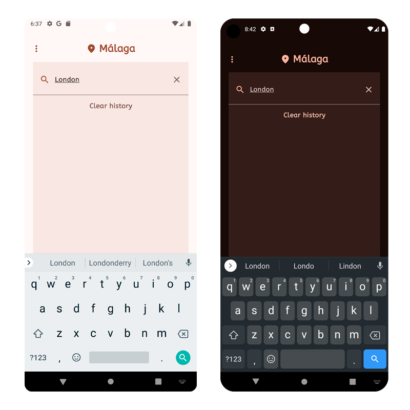

# Weather

**Weather** is a mobile application for Android designed to search the forecast weather from a city. It is a simple project that uses the following features.

## Features🛠️
*  MVVM architecture.
* Coroutines
*  Dependency injection with Hilt
*  RooDatabase
*  Splash 
*  LiveData
*  Flows
*  StateFlow
*  Jetpack Compose
* Material 3
* Api [Visual Crossing](https://www.visualcrossing.com/)

## Views Light/Dark Mode
* Visutal device 28/30

### Splash

### Home

### Details

### Search

### Menu

### Metrics

### About

### Exit

## Configuration API :globe_with_meridians:
Use the Visual crossing API, you have to register on their website. Add your **API_KEY** to the **local properties** file of the project.

## Note :speech_balloon:
Some features are being improved.

## Thank You🍀
Thank you so much for getting here!
